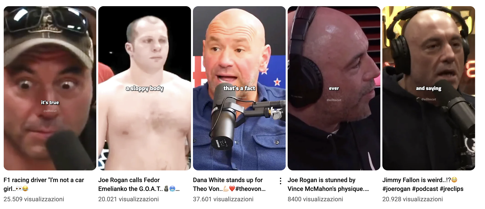
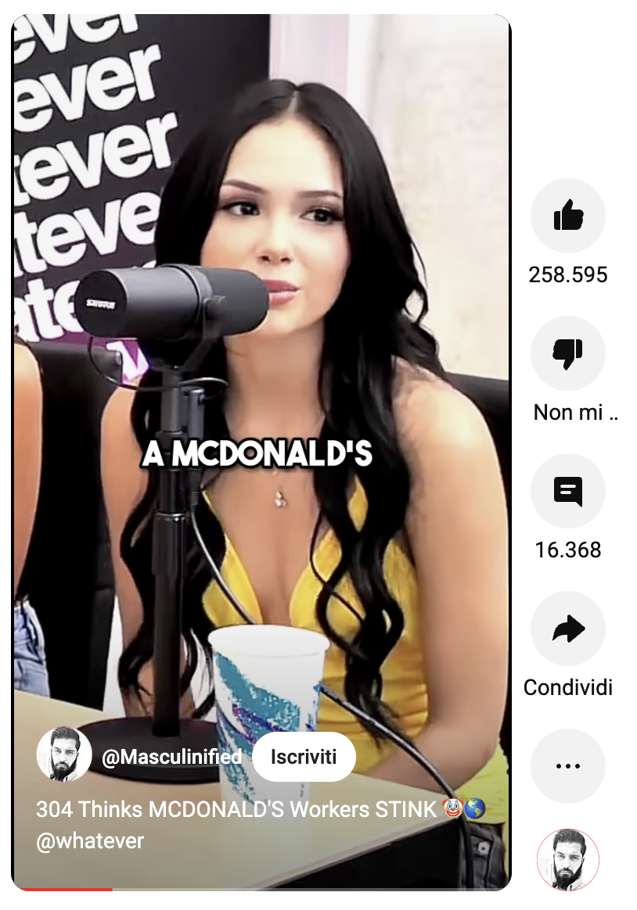
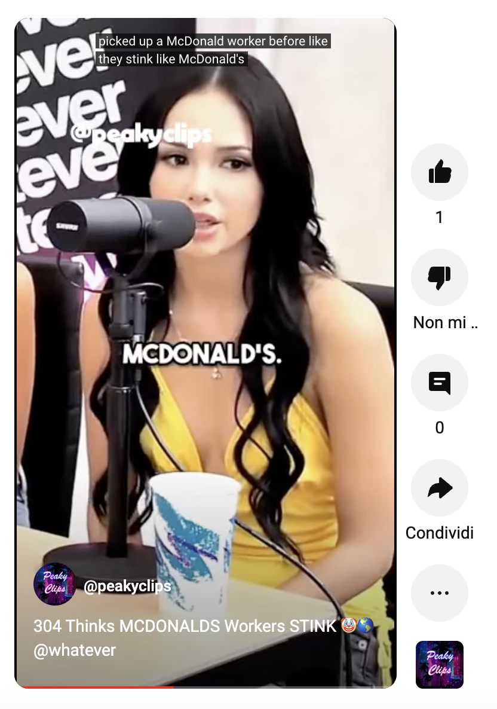

# Youtube and tiktok automation

### Bot name is still undecided :)

## What is this?

Wanna create a youtube channel or tiktok account with podcasts clips but don't have time to edit the videos? This bot will do it for you.

is it ethical? probably not.
is it working? yes.

## How does it work?

basically you'll steal other people's content from youtube and upload it to your channel and tiktok account using the same title and tags.
the bot will schedule the videos to be uploaded to youtube.
the bot will also upload the videos to tiktok (without scheduling).
the bot will also create a watermark on the videos.

## Example

  
  

## What do you need?

1. You need to have a youtube channel and a tiktok account (tiktok account is optional).
2. You need to grab channel ids of channels you want to steal content from.
3. you'll need to create credentials in the Google Developers Console and download the client secret file

## how to create credentials in the Google Developers Console

1. **Go to the Google Developers Console:** Visit the Google Developers Console.

2. **Create a new project or select an existing one:** If you haven't created a project yet, click on "Select a project" on the top left corner and then click on "New Project". Give it a name and click "Create".

3. **Enable the YouTube Data API:** In the sidebar, navigate to "APIs & Services" > "Library". Search for "YouTube Data API" and click on it. Then click "Enable".

4. **Create OAuth 2.0 credentials:**

   - Go to "APIs & Services" > "Credentials".
   - Click on "Create credentials" and select "OAuth client ID".
   - Choose the application type (Web application, Android, iOS, etc.). For accessing YouTube data from your server or local machine, select "Web application".
   - Fill in the required information, like name and authorized redirect URIs (if applicable).

5. **Download the client secret JSON file:**

   - After creating the credentials, you'll see the details. Click on the download icon next to your newly created OAuth client ID.
   - This file is the client_secret.json file you'll need for accessing the YouTube API.

6. **Rename the client secret file to client_secret.json and place it inside src/memory/**

## How to install?

1. clone the repo
2. install the dependencies with pip
3. search for idChannels inside src/start.py and replace the ids with the channels ids you want to steal content from
4. if you're planning to upload to tiktok, you'll need to get your session id and place it inside .env file following the .env.example file

## How to use?

1. run the bot with `python main.py --help` to see the available options
2. run `python main.py -c` to steal all last content from all the channels you specified in the idChannels list and upload it to your youtube channel.
   add option `-t` to upload to tiktok too.
3. run `python main.py -l LINK` to steal a specific video from a specific channel and upload it to your youtube channel.
   add option `-t` to upload to tiktok too.

## This project is open source, feel free to contribute, there are a lot of things to do and improve.
